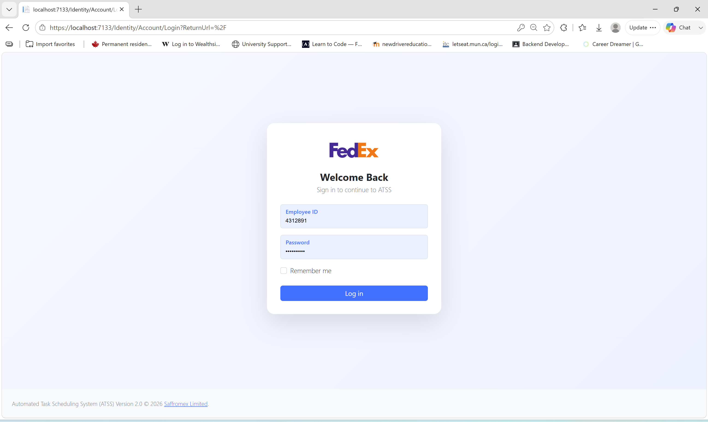
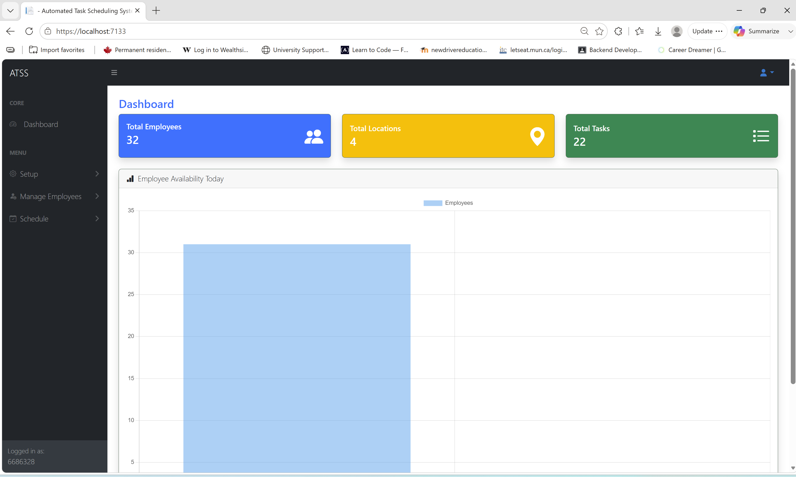
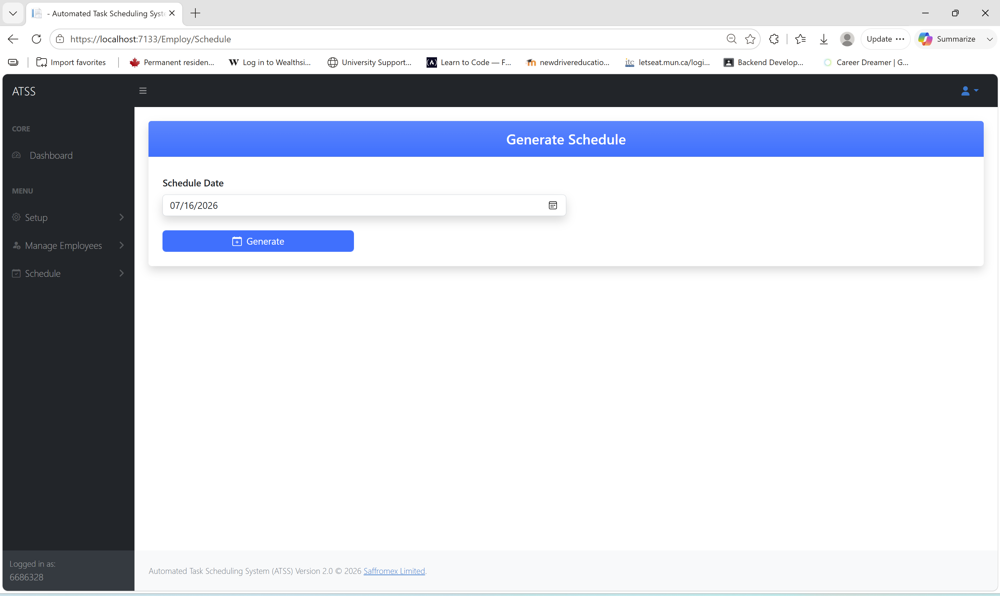
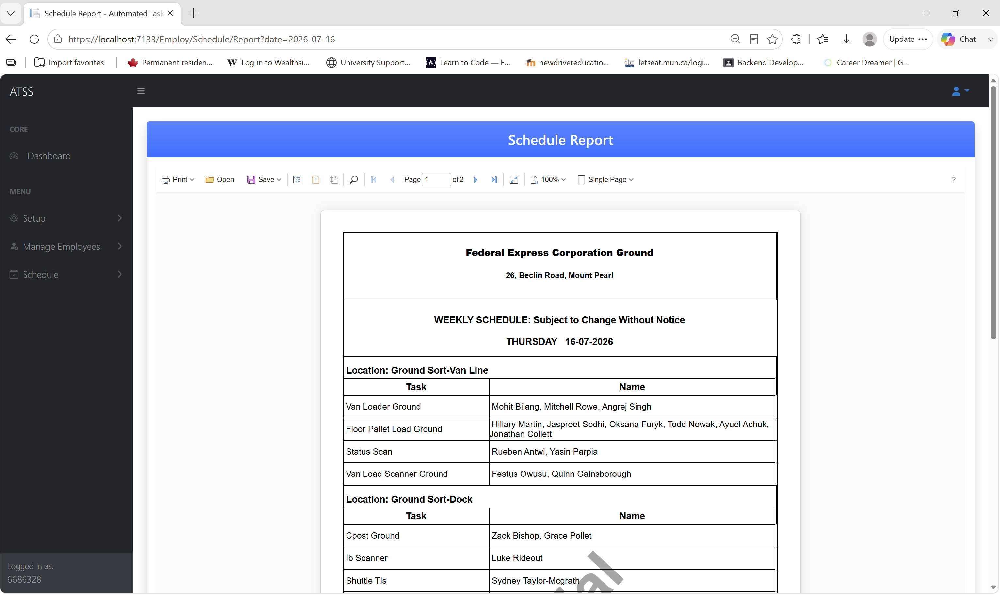
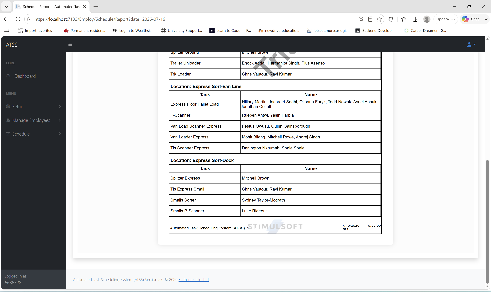

# Automated Task Scheduling System (ATSS)

## Overview

The Automated Task Scheduling System (ATSS) is a web-based workforce management application developed using ASP.NET Core MVC and Entity Framework Core. The system automates the scheduling of employees to operational tasks while enforcing business rules, employee availability, workload balancing, role restrictions, and task assignment constraints.

The primary objective of the system is to eliminate manual scheduling processes, reduce scheduling conflicts, improve fairness in task allocation, and increase operational efficiency.

---

## Key Features

### Employee Management

* Create, update, and manage employee records
* Bulk employee upload using CSV files
* Employee position assignment
* Employee availability tracking

### Task Management

* Create and manage operational tasks
* Define minimum and maximum employee requirements per task
* Associate tasks with locations

### Location Management

* Create and maintain work locations
* Assign tasks to specific operational locations

### Automated Schedule Generation

* Generate schedules automatically based on employee availability
* Prevent assignment of employees to the same task on consecutive days
* Support equivalent task pairing rules
* Enforce gender-based task restrictions where required
* Ensure fair employee distribution across tasks
* Respect minimum and maximum staffing requirements

### Schedule Reporting

* Generate daily schedules
* Print schedules using Stimulsoft Reports
* Export reports for operational use

### User Management

* ASP.NET Core Identity authentication
* Role-based authorization
* User registration
* Role assignment
* Password reset
* Account lock and unlock functionality

### Dashboard

* Employee statistics
* Task statistics
* Location statistics
* Schedule monitoring

---

## Technology Stack

### Backend

* ASP.NET Core MVC (.NET 10)
* ASP.NET Core Identity
* Entity Framework Core
* Repository Pattern
* Unit of Work Pattern

### Frontend

* Razor Pages
* Bootstrap 5
* jQuery
* DataTables
* SweetAlert2
* Toastr Notifications

### Database

* Microsoft SQL Server
* Entity Framework Core Migrations

### Reporting

* Stimulsoft Reports

---

## System Architecture

The solution follows a layered architecture consisting of:

### Presentation Layer

Provides the user interface through ASP.NET Core MVC Controllers, Razor Views, and Identity Pages.

### Business Logic Layer

Contains scheduling algorithms, validation rules, and application workflows.

### Data Access Layer

Implements the Repository and Unit of Work patterns for database operations.

### Database Layer

Stores employee, task, location, schedule, and user data using SQL Server.

---

## Scheduling Rules

The scheduling engine enforces the following business rules:

* Employees must be available on the selected schedule date.
* Employees should not perform the same task on consecutive days.
* Female employees cannot be assigned to restricted tasks such as Trailer Unloader.
* Equivalent tasks may share the same assigned employees.
* Task staffing levels must satisfy configured minimum and maximum requirements.
* Employees should be distributed fairly across available tasks.

---

## Project Structure

```text
AutomatedTaskSchedulingSystem
│
├── AutomatedTaskSchedulingSystem
│   ├── Areas
│   ├── Controllers
│   ├── Views
│   ├── wwwroot
│   └── Program.cs
│
├── AutomatedTaskSchedulingSystem.DataAccess
│   ├── Data
│   ├── Repository
│   └── Migrations
│
├── AutomatedTaskSchedulingSystem.Models
│   ├── Model
│   └── ViewModel
│
└── AutomatedTaskSchedulingSystem.Utility
```

---

## Installation

### Prerequisites

* .NET 10 SDK
* Microsoft SQL Server
* Visual Studio 2026 or later

### Database Setup

Update the connection string in:

```json
appsettings.json
```

Run migrations:

```bash
dotnet ef database update
```

### Run the Application

```bash
dotnet restore
dotnet build
dotnet run
```

---

## Authentication and Authorization

The system uses ASP.NET Core Identity for secure authentication and role-based authorization.

### Roles

#### Administrator

Administrators have full access to the system and can:

* Manage users
* Assign user roles
* Lock and unlock user accounts
* Reset passwords
* Manage employees
* Manage locations
* Manage tasks
* Generate schedules
* View reports

#### Employee

Employees have access only to the functionality assigned to their role.

### Security Features

* ASP.NET Core Identity Authentication
* Role-Based Authorization
* Password Policies
* Account Lockout Protection
* Secure Session Management
* Email Confirmation Support

---

## Dashboard Features

The dashboard provides quick access to key operational metrics including:

The Automated Task Scheduling System (ATSS) is a web-based workforce management application developed using ASP.NET Core MVC and Entity Framework Core. The system automates the scheduling of employees to operational tasks while enforcing business rules, employee availability, workload balancing, role restrictions, and task assignment constraints.

The primary objective of the system is to eliminate manual scheduling processes, reduce scheduling conflicts, improve fairness in task allocation, and increase operational efficiency.

---

## Key Features

### Employee Management

* Create, update, and manage employee records
* Bulk employee upload using CSV files
* Employee position assignment
* Employee availability tracking

### Task Management

* Create and manage operational tasks
* Define minimum and maximum employee requirements per task
* Associate tasks with locations

### Location Management

* Create and maintain work locations
* Assign tasks to specific operational locations

### Automated Schedule Generation

* Generate schedules automatically based on employee availability
* Prevent assignment of employees to the same task on consecutive days
* Support equivalent task pairing rules
* Enforce gender-based task restrictions where required
* Ensure fair employee distribution across tasks
* Respect minimum and maximum staffing requirements

### Schedule Reporting

* Generate daily schedules
* Print schedules using Stimulsoft Reports
* Export reports for operational use

### User Management

* ASP.NET Core Identity authentication
* Role-based authorization
* User registration
* Role assignment
* Password reset
* Account lock and unlock functionality

### Dashboard

* Employee statistics
* Task statistics
* Location statistics
* Schedule monitoring

---

## Technology Stack

### Backend

* ASP.NET Core MVC (.NET 10)
* ASP.NET Core Identity
* Entity Framework Core
* Repository Pattern
* Unit of Work Pattern

### Frontend

* Razor Pages
* Bootstrap 5
* jQuery
* DataTables
* SweetAlert2
* Toastr Notifications

### Database

* Microsoft SQL Server
* Entity Framework Core Migrations

### Reporting

* Stimulsoft Reports

---

## System Architecture

The solution follows a layered architecture consisting of:

### Presentation Layer

Provides the user interface through ASP.NET Core MVC Controllers, Razor Views, and Identity Pages.

### Business Logic Layer

Contains scheduling algorithms, validation rules, and application workflows.

### Data Access Layer

Implements the Repository and Unit of Work patterns for database operations.

### Database Layer

Stores employee, task, location, schedule, and user data using SQL Server.

---

## Scheduling Rules

The scheduling engine enforces the following business rules:

* Employees must be available on the selected schedule date.
* Employees should not perform the same task on consecutive days.
* Female employees cannot be assigned to restricted tasks such as Trailer Unloader.
* Equivalent tasks may share the same assigned employees.
* Task staffing levels must satisfy configured minimum and maximum requirements.
* Employees should be distributed fairly across available tasks.

---

## Project Structure

```text
AutomatedTaskSchedulingSystem
│
├── AutomatedTaskSchedulingSystem
│   ├── Areas
│   ├── Controllers
│   ├── Views
│   ├── wwwroot
│   └── Program.cs
│
├── AutomatedTaskSchedulingSystem.DataAccess
│   ├── Data
│   ├── Repository
│   └── Migrations
│
├── AutomatedTaskSchedulingSystem.Models
│   ├── Model
│   └── ViewModel
│
└── AutomatedTaskSchedulingSystem.Utility
```

---

## Installation

### Prerequisites

* .NET 10 SDK
* Microsoft SQL Server
* Visual Studio 2026 or later

### Database Setup

Update the connection string in:

```json
appsettings.json
```

Run migrations:

```bash
dotnet ef database update
```

### Run the Application

```bash
dotnet restore
dotnet build
dotnet run
```

---

## Authentication and Authorization

The system uses ASP.NET Core Identity for secure authentication and role-based authorization.

### Roles

#### Administrator

Administrators have full access to the system and can:

* Manage users
* Assign user roles
* Lock and unlock user accounts
* Reset passwords
* Manage employees
* Manage locations
* Manage tasks
* Generate schedules
* View reports

#### Employee

Employees have access only to the functionality assigned to their role.

### Security Features

* ASP.NET Core Identity Authentication
* Role-Based Authorization
* Password Policies
* Account Lockout Protection
* Secure Session Management
* Email Confirmation Support

---

## Dashboard Features

The dashboard provides quick access to key operational metrics including:

* Total Employees
* Total Tasks
* Total Locations
* Employee Availability


---

## Reporting

The application integrates with Stimulsoft Reports to provide:

* Daily Schedule Reports
* Printable Schedule Documents
* Exportable Reports
* Operational Workforce Planning Outputs

---


## Development Practices

* Total Employees
* Total Tasks
* Total Locations
* Employee Availability
The project follows modern software engineering principles including:

* Repository Pattern
* Unit of Work Pattern
* Dependency Injection
* Separation of Concerns
* Entity Framework Core Code-First Migrations
* Identity-Based Security
* Layered Architecture

---


* Daily Schedule Reports
* Printable Schedule Documents
* Exportable Reports
* Operational Workforce Planning Outputs
##  Application Images

---

*Figure 1: Login Page*


*Figure 2: Dashboard*


## Development Practices

*Figure 3: Generate Schedule*

The project follows modern software engineering principles including:

*Figure 4: Schedule Report*


---

*Figure 5: Schedule Report2*

## Author
---
## Author

**Oluwadamilola Samuel Ademiluyi (Dammy)**

Full Stack Software Engineer

### Technical Skills

* .Net
* ASP.NET
* C#
* Entity Framework Core
* SQL Server
* MySQL
* ASP.NET Identity
* JavaScript
* jQuery
* Bootstrap
* React
* Node.js
* Python
* Azure Cloud Services

---

## License

This project was developed for workforce scheduling automation and software engineering practices.

© 2026 Oluwadamilola Samuel Ademiluyi. All rights reserved.

